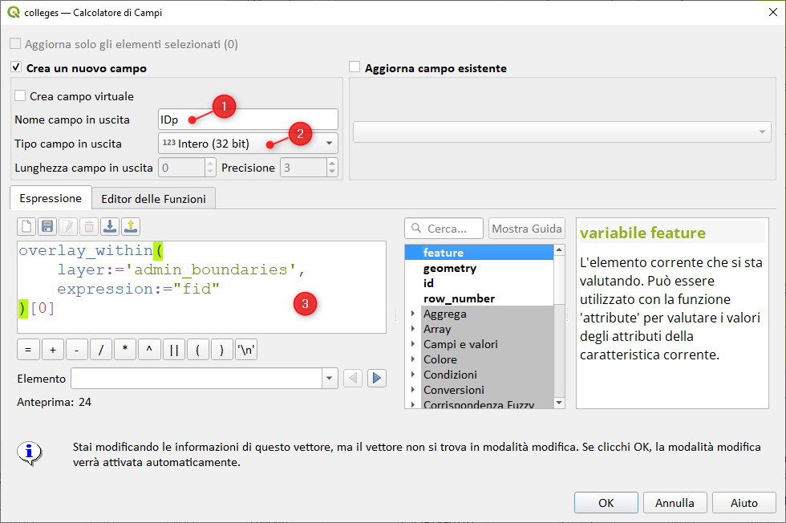
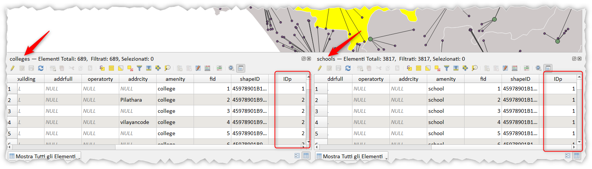
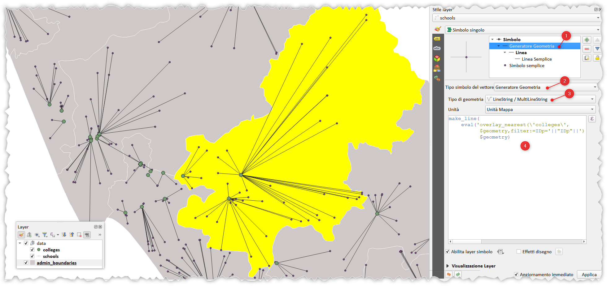
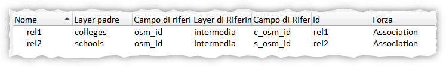
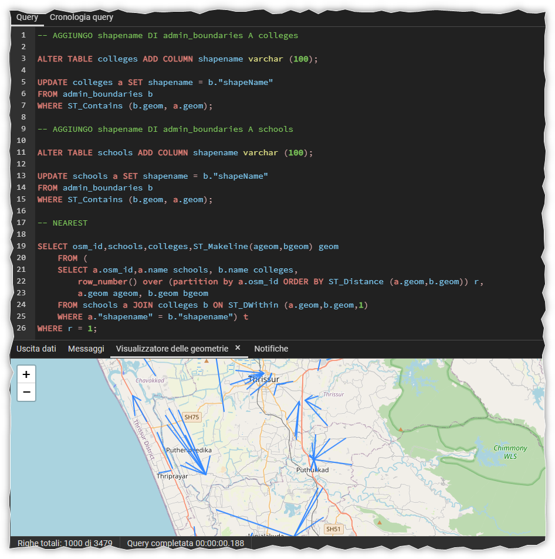

# Spatial Join Condizionato

2023-08-25 Sfida di analisi spaziale

Collega ciascuna scuola all'università più vicina nella stessa regione amministrativa.


<!-- TOC -->

- [Spatial Join Condizionato](#spatial-join-condizionato)
- [Totò FIANDACA](#totò-fiandaca)
  - [PASSO 1:](#passo-1)
  - [PASSO 2:](#passo-2)
  - [DATI e PROGETTO](#dati-e-progetto)
  - [ALTRE ESPRESSIONI](#altre-espressioni)
  - [RELAZIONE N:N](#relazione-nn)
    - [TABELLA INTERMEDIA](#tabella-intermedia)
- [Reymar SANCHEZ](#reymar-sanchez)
  - [QUERY](#query)
- [Bert Temme](#bert-temme)
- [RIFERIMENTI](#riferimenti)
  - [video Youtube](#video-youtube)
- [DISCLAIMER](#disclaimer)

<!-- /TOC -->

# Totò FIANDACA

## PASSO 1:

Trasferire `fid` del layer `admin_boundaries` ai due layer puntuali `schools` e `colleges`:

aggiungere un attributo `IDp` numerico e popolarlo con:

```
overlay_within(
    layer:='admin_boundaries',
    expression:="fid"
)[0]
```




## PASSO 2:

per collegare (tramite un segmento) ciascuna scuola (schools) all'università (colleges) più vicina nelle stessa regione amministrativa, usare l'espressione:

```
make_line(
    eval('overlay_nearest(\'colleges\',
          $geometry,filter:=IDp='||"IDp"||')')[0],
          $geometry)
```

nel generatore di geometrie:



## DATI e PROGETTO

[DATI](./dati/)

## ALTRE ESPRESSIONI

```
make_line(@geometry,
          geometry(
            array_filter( 
            overlay_nearest('colleges',@feature,limit:=-1), 
            attribute( @element, 'IDp' ) = "IDp" )[0]))
```
## RELAZIONE N:N

Creando due relazione di progetto su `colleges` e `schools` (perché la relazione tra loro è N:N)




<https://github.com/pyarchinit/selectbyrelationship_repo>

### TABELLA INTERMEDIA

Nella tabella degli attributi delle `schools` aggiungo un attributo `c_osm_id` e lo popolo con l'espressione:

```
eval('overlay_nearest(\'colleges\',
          osm_id,filter:=IDp='||"IDp"||')')[0]
```


vedi `progetto_rel`

# Reymar SANCHEZ

<https://twitter.com/SanchezReymar/status/1695078310198280503/>

Dati caricati in PostgreSQL/PostGIS

## QUERY

```SQL
-- AGGIUNGO shapename DI admin_boundaries A colleges

ALTER TABLE colleges ADD COLUMN shapename varchar (100);

UPDATE colleges a SET shapename = b."shapeName"
FROM admin_boundaries b
WHERE ST_Contains (b.geom, a.geom);

-- AGGIUNGO shapename DI admin_boundaries A schools

ALTER TABLE schools ADD COLUMN shapename varchar (100);

UPDATE schools a SET shapename = b."shapeName" 
FROM admin_boundaries b
WHERE ST_Contains (b.geom, a.geom);

-- NEAREST

SELECT osm_id,schools,colleges,ST_Makeline(ageom,bgeom) geom
    FROM (
    SELECT a.osm_id,a.name schools, b.name colleges, 
        row_number() over (partition by a.osm_id ORDER BY ST_Distance (a.geom,b.geom)) r, 
        a.geom ageom, b.geom bgeom
    FROM schools a JOIN colleges b ON ST_DWithin (a.geom,b.geom,1)
    WHERE a."shapename" = b."shapename") t
WHERE r = 1;
```



# Bert Temme

repo: <https://github.com/bertt/spatial_analysis_challenge/blob/main/README.md>


# RIFERIMENTI

- <https://twitter.com/spatialthinkies/status/1695021747177951435/>
- QGIS: https://www.qgis.org/it/site/
- ISSUE: <https://github.com/qgis/QGIS/issues/43146>
- SE: <https://gis.stackexchange.com/questions/391120/qgis-expression-with-overlay-fuction-filter-condition-based-on-comparison-of-at>
- Blog post Pigreconfinito: <https://pigrecoinfinito.com/2021/11/01/qgis-e-lo-spatial-join-condizionato/>

## video Youtube

[](https://https://youtu.be/G4e4bUxuMS0 "Video")


# DISCLAIMER

Il presente contenuto è stato realizzato da _**Salvatore Fiandaca**_ nel mese di agosto 2023 utilizzando [QGIS 3.28 Firenze LTR](https://qgis.org/it/site/) e distribuito con licenza [CC BY 4.0](https://creativecommons.org/licenses/by/4.0/deed.it)